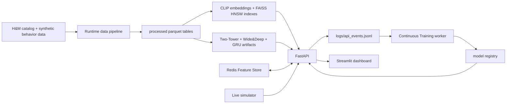
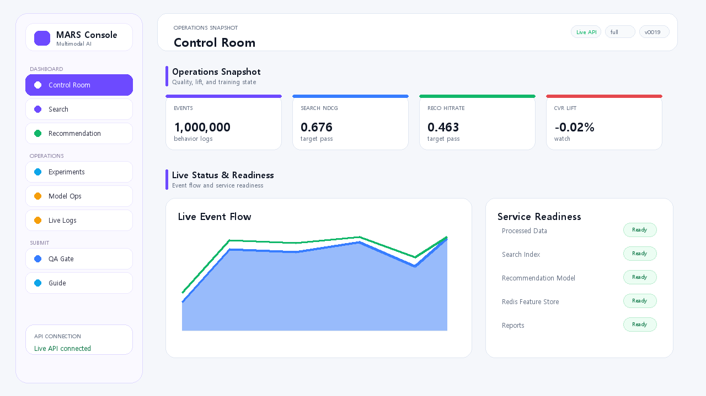
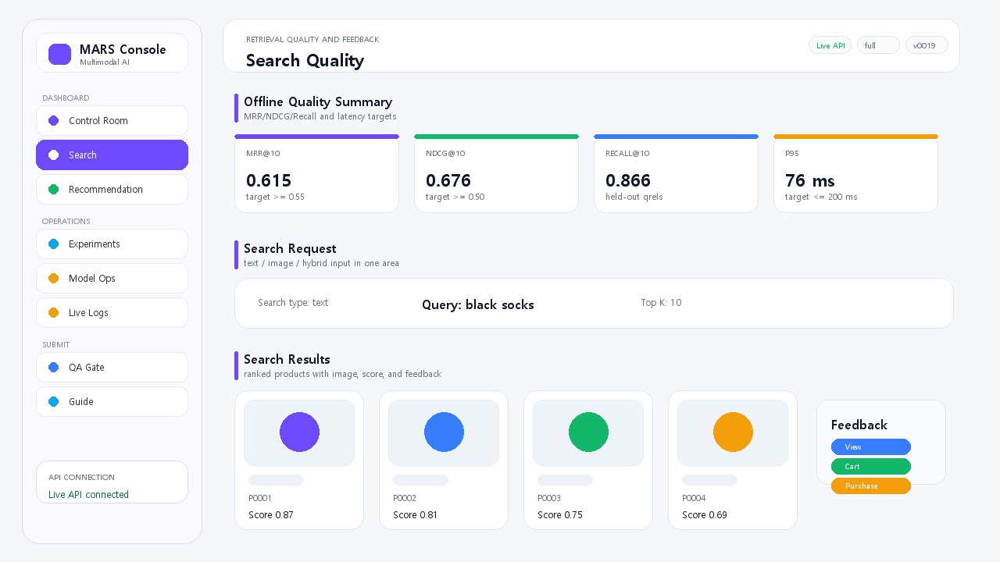
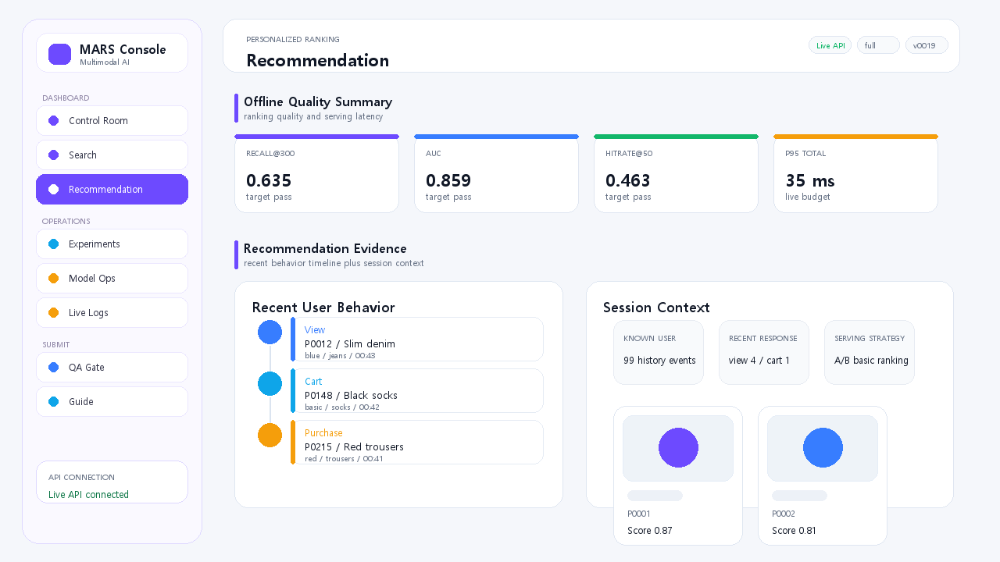
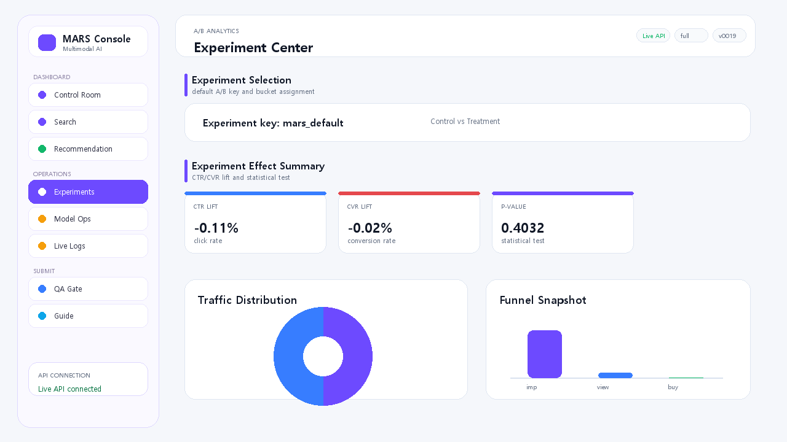
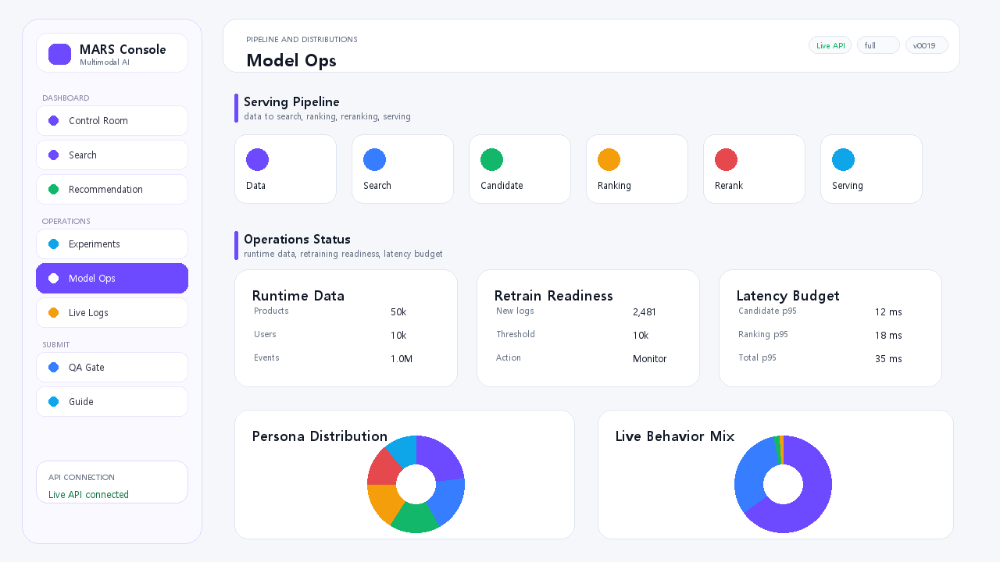
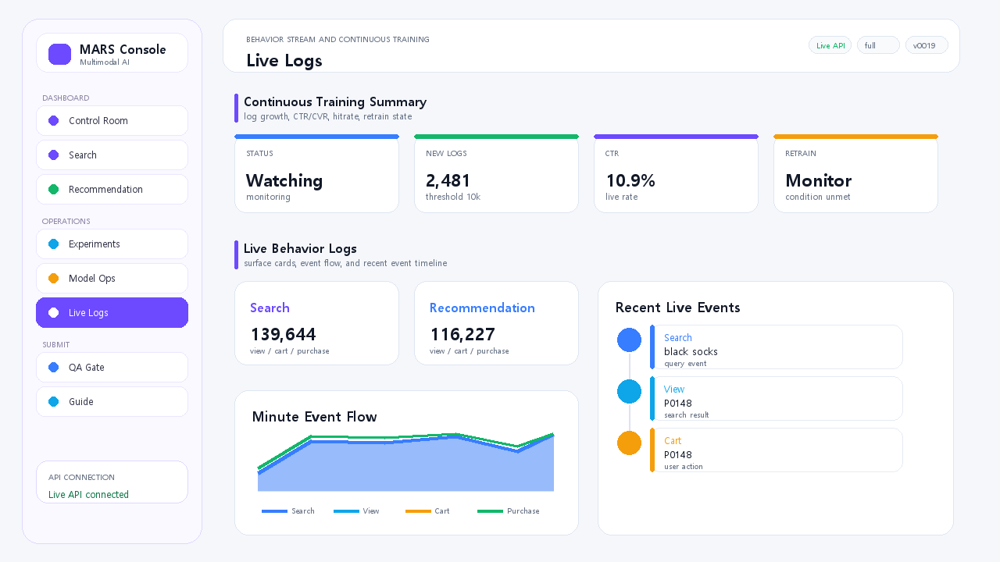
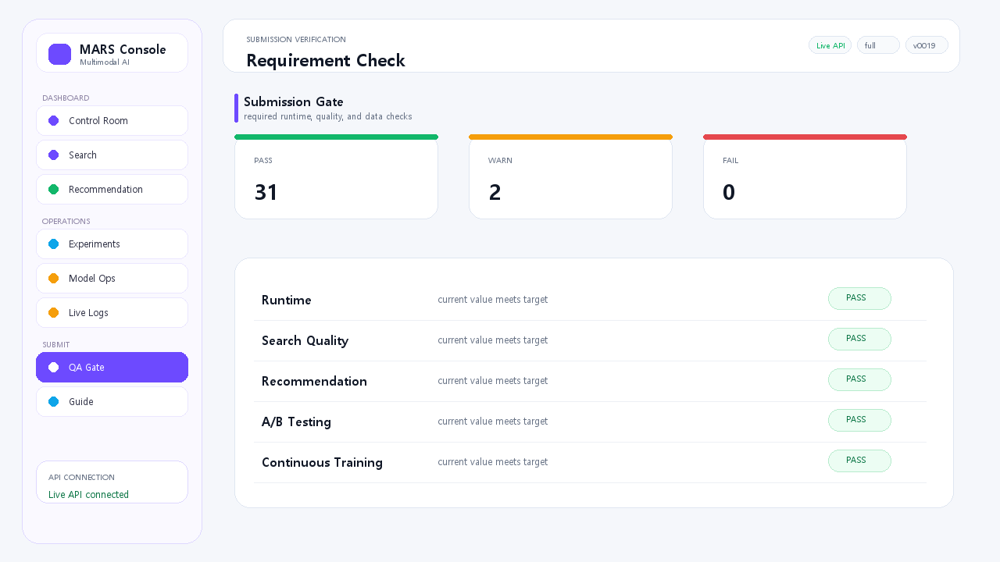

# MARS

MARS는 H&M 기반 패션 상품을 대상으로 text/image/hybrid 검색, 개인화 추천, A/B 테스트, 행동 로그 시뮬레이터, Redis Feature Store, Continuous Training, Streamlit 운영 대시보드를 Docker Compose로 실행하는 캡스톤 프로젝트입니다.

## Status

최종 실행 기준은 `full` mode, seed `42`입니다.

| 항목 | 현재값 |
| --- | ---: |
| Products | 50,000 |
| Users | 10,000 |
| Events | 1,000,000 |
| Search qrels | 193,064 |
| Search test queries | 19,194 |
| Recommendation test instances | 400 |

핵심 정량 지표는 `artifacts/reports/metrics.json` 기준으로 명세서 요구사항을 충족합니다.

| Area | Metric | Target | Result |
| --- | --- | ---: | ---: |
| Search | MRR@10 | >= 0.55 | 0.6152 |
| Search | NDCG@10 | >= 0.50 | 0.6762 |
| Search | Recall@10 | reference | 0.8664 |
| Search | p95 latency | <= 200 ms | 76.05 ms |
| Recommendation | Recall@300 | >= 0.30 | 0.6350 |
| Recommendation | HitRate@50 | >= 0.20 | 0.4625 |
| Recommendation | NDCG@50 | >= 0.08 | 0.2936 |
| Recommendation | Coverage@50 | >= 0.20 | 0.2032 |
| Recommendation | Ranking AUC | >= 0.70 | 0.8593 |
| Recommendation | Total p95 latency | <= 200 ms | 35.29 ms |

## Quick Start

이 repository는 코드와 문서 중심으로 관리합니다. 대용량 H&M data와 runtime artifact는 GitHub에 포함하지 않습니다.

실행 전에 아래 둘 중 하나가 필요합니다.

| 방식 | 필요한 준비 |
| --- | --- |
| Runtime data bundle 사용 | 전달받은 bundle을 repo 루트에 풀어서 `data/processed/manifest.json`이 존재하게 둡니다. |
| 외부 data 폴더 재사용 | 기존 data 폴더를 그대로 두고 `MARS_HOST_DATA_DIR` 환경변수로 경로를 지정합니다. |

검증된 재현 명령은 다음과 같습니다.

```bash
git clone https://github.com/steven010808/MARS.git
cd MARS
MARS_HOST_DATA_DIR=/mnt/f/롱스톤/mars/data bash scripts/run_mars.sh
```

data 폴더를 repo 루트에 직접 풀어둔 경우에는 환경변수 없이 실행할 수 있습니다.

```bash
bash scripts/run_mars.sh
```

직접 Docker Compose를 실행할 때도 외부 data 폴더를 쓰려면 같은 환경변수를 지정합니다.

```bash
MARS_HOST_DATA_DIR=/mnt/f/롱스톤/mars/data \
docker compose up -d --build
docker compose ps
```

| Service | URL |
| --- | --- |
| FastAPI | `http://localhost:8000` |
| API Swagger | `http://localhost:8000/docs` |
| Streamlit Dashboard | `http://localhost:8501` |
| Redis | `localhost:6379` |

API smoke check:

```bash
python -m scripts.checks.smoke_api --base-url http://localhost:8000 --timeout 240
```

`scripts/run_mars.sh`는 실행 전에 data 위치를 확인합니다. data가 없으면 Docker를 오래 돌리기 전에 필요한 파일과 경로 예시를 출력하고 중단합니다.

## Architecture



## Project Layout

```text
.
|- apps/
|  |- api/                 # FastAPI endpoint and runtime adapters
|  |- dashboard/           # Streamlit dashboard
|  |- simulator/           # Docker simulator entrypoint
|  `- worker/              # Docker CT worker entrypoint
|- src/mars/
|  |- config/              # typed config loader
|  |- data/                # H&M runtime pipeline and simulator fallback
|  |- search/              # CLIP encoder, FAISS artifacts, search service
|  |- retrieval/           # vector index helpers
|  |- recommendation/      # candidate, ranking, reranking, session logic
|  |- evaluation/          # metric and A/B evaluation
|  `- ct/                  # continuous training monitor and registry
|- src/evaluation/         # spec compatibility wrapper
|- scripts/                # build, evaluation, runtime, check, packaging tools
|- tests/                  # API, search, recommendation, simulator, CT tests
|- configs/config.yaml
|- docker-compose.yml
|- Dockerfile
`- docs/
```

`apps/`, `src/mars/`, `scripts/`가 최종 runtime 기준입니다. `src/evaluation/`은 명세서의 `src/evaluation/metrics.py` 경로 요구를 만족시키기 위한 compatibility wrapper입니다.

## Dashboard Preview

대시보드는 Streamlit 기반이며, 검색/추천 품질과 운영 상태를 한 화면에서 확인할 수 있도록 페이지를 분리했습니다. 아래 이미지는 `artifacts/ui_redesign/`에 포함된 최신 가이드 이미지입니다.

| Page | Preview |
| --- | --- |
| 통합 현황 |  |
| 검색 |  |
| 추천 |  |
| 실험 분석 |  |
| 모델 운영 |  |
| 라이브 로그 |  |
| 제출 검증 |  |

가이드 이미지는 다음 명령으로 다시 생성할 수 있습니다.

```bash
python scripts/dashboard/generate_guide_images.py
```

## Core Features

| Requirement | Implementation |
| --- | --- |
| Text/Image/Hybrid search | `apps/api/main.py`, `src/mars/search/` |
| CLIP multimodal embeddings | `src/mars/search/encoders.py` |
| FAISS ANN search | HNSW indexes in `artifacts/search/*.faiss` |
| Query behavior model | train-split-only model in `artifacts/search/query_behavior_model.json.gz` |
| Recommendation candidate generation | Two-Tower style artifacts and service candidate stage |
| Ranking | Wide&Deep-style ranker features in `src/mars/recommendation/models.py` |
| Session personalization | GRU session encoder and live session store |
| Re-ranking and exploration | transition/category rerank, exploration slots, MAB-compatible strategy split |
| A/B testing | `/api/ab/assign`, `/api/ab/report`, two-proportion z-test |
| Redis Feature Store | API/session adapters backed by Redis |
| Continuous Training | worker loop, live log monitor, registry hot reload |
| Dashboard | search, recommendation, experiment, model ops, live log, QA, guide pages |

## Search Evaluation Protocol

검색 품질 평가는 Microsoft H&M synthetic qrels를 proxy benchmark로 사용합니다. 원본 H&M 데이터는 실제 검색어와 relevance label을 제공하지 않기 때문에, query별 positive/negative relevance가 있는 qrels를 사용합니다.

| 항목 | 값 |
| --- | --- |
| Split | `query_id` hash 기반 deterministic train/valid/test split |
| Seed | `42` |
| Train rows | `154,652` |
| Valid rows | `19,218` |
| Test rows | `19,194` |
| Query-id overlap | `0` |
| Evaluation split | held-out `test` |
| Primary metrics | MRR@10, NDCG@10, Recall@10 |

검색 서비스는 test qrels를 직접 읽지 않습니다. train split으로 생성된 behavior model artifact와 CLIP/FAISS index를 로드하고, 평가는 별도 runner가 held-out test split으로 수행합니다.

## Recommendation Evaluation Protocol

추천 평가는 `test_events`의 session click prediction을 primary task로 둡니다. 사용자의 현재 세션 문맥이 주어진 상태에서 다음 클릭 후보를 상위 후보군과 최종 추천 결과에 얼마나 잘 포함하는지 측정합니다.

| Stage | Metric |
| --- | --- |
| Candidate generation | Recall@300 |
| Ranking | AUC |
| Final recommendation | HitRate@50, NDCG@50, Coverage@50 |
| Serving | candidate/ranking/reranking/total latency |

## Continuous Training

1. API와 simulator가 live behavior event를 `logs/api_events.jsonl`에 적재합니다.
2. Worker가 신규 로그 수, HitRate, CTR 등을 주기적으로 확인합니다.
3. 신규 로그가 threshold를 넘거나 품질 지표가 기준을 하회하면 retrain trigger를 발생시킵니다.
4. 기본 제출 설정에서는 추천 artifact의 lightweight live refresh를 수행하고 model registry에 새 버전을 등록합니다.
5. API는 active registry version 변경을 감지해 다음 요청부터 lazy hot reload로 새 artifact를 반영합니다.

검색 feedback refresh 코드는 포함되어 있지만, 기본 데모가 지연되지 않도록 `configs/config.yaml`에서 `search.online_learning.auto_refresh: false`로 둡니다. 필요하면 아래 명령으로 검색 behavior model을 별도 갱신할 수 있습니다.

```bash
python -m scripts.artifacts.refresh_search_behavior_model --config configs/config.yaml
```

## Build and Validation Commands

전체 artifact를 재생성:

```bash
python -m scripts.runtime.bootstrap_runtime --config configs/config.yaml --mode full
```

검색 FAISS index만 기존 embedding에서 HNSW로 재생성:

```bash
python -m scripts.artifacts.rebuild_search_faiss_indexes --config configs/config.yaml
```

정량 평가:

```bash
python -m scripts.evaluation.evaluate_required_scale --config configs/config.yaml --mode full
```

품질/테스트:

```bash
python -m ruff check apps src scripts tests
python -m ruff format --check apps src scripts tests
python -m pytest -q
```

## Data and Artifact Sharing

GitHub에는 소스 코드와 문서 중심으로 올리고, 대용량 runtime data/artifact는 별도 bundle로 전달하는 방식을 권장합니다.

```bash
python -m scripts.packaging.package_runtime_bundle --dry-run
python -m scripts.packaging.package_runtime_bundle --output dist/mars_runtime_bundle.zip
python -m scripts.packaging.package_runtime_bundle --output dist/mars_runtime_bundle_with_images.zip --include-images
```

Runtime-light bundle은 H&M 원본 이미지와 raw dataset을 제외하고 `data/processed/`, `artifacts/`, 코드, 문서, 설정을 포함합니다. 검색/추천 API와 정량 지표 검증은 processed data와 artifacts만으로 실행됩니다. 상품 사진 preview까지 필요하면 `--include-images` 옵션으로 이미지 포함 bundle을 생성합니다.

## Documentation

| Document | Purpose |
| --- | --- |
| `docs/README.md` | 제출 문서 인덱스 |
| `docs/architecture.md` | 시스템 아키텍처 |
| `docs/api.md` | API 상세 명세 |
| `docs/evaluation_report.md` | 검색/추천/A-B 평가 리포트 |
| `docs/code_traceability.md` | 명세 요구사항과 코드 대응표 |
| `docs/runtime_bundle_guide.md` | 다른 PC 전달 및 runtime bundle 가이드 |
