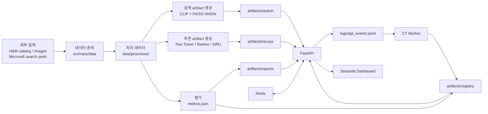

# 시스템 아키텍처

MARS는 H&M 기반 상품 데이터를 사용해 검색, 추천, 평가, 운영 대시보드를 하나의 Docker Compose 환경에서 실행하는 시스템이다.

## 1. 전체 구성

## 2. 실행 흐름

1. `bootstrap` 서비스가 processed data, 검색/추천 artifact, 평가 리포트, registry를 준비한다.
2. `api` 서비스가 검색, 추천, 이벤트 수집, metric, A/B endpoint를 제공한다.
3. `dashboard` 서비스가 API 결과와 metric을 화면에 표시한다.
4. `simulator` 서비스가 live event를 API로 전송한다.
5. `worker` 서비스가 live log와 metric을 확인해 CT 상태와 registry를 갱신한다.
6. `redis`는 세션 기반 최근 행동과 실시간 counter를 저장한다.

## 3. 주요 디렉터리

| 경로 | 역할 |
| --- | --- |
| `apps/api` | FastAPI entrypoint와 API adapter |
| `apps/dashboard` | Streamlit dashboard |
| `apps/simulator` | live simulator entrypoint |
| `apps/worker` | CT worker entrypoint |
| `src/mars/data` | 데이터 준비, simulator, split 생성 |
| `src/mars/search` | CLIP encoder, FAISS index, 검색 서비스 |
| `src/mars/recommendation` | 후보 생성, ranking, re-ranking, session logic |
| `src/mars/evaluation` | 검색/추천/A-B 평가 |
| `src/mars/ct` | model registry와 CT monitor |
| `scripts/runtime` | Docker 실행 전후 bootstrap/worker loop |
| `scripts/artifacts` | artifact 재생성 유틸리티 |

## 4. 데이터와 artifact

| 구분 | 경로 |
| --- | --- |
| 외부 상품 데이터 | `data/external/hm/` |
| Microsoft search qrels | `data/external/hnm_search/` |
| simulator 중간 CSV | `data/raw/` |
| 처리된 parquet | `data/processed/` |
| 검색 artifact | `artifacts/search/` |
| 추천 artifact | `artifacts/recsys/` |
| 평가 리포트 | `artifacts/reports/` |
| model registry | `artifacts/registry/` |

Git에는 코드와 문서만 포함한다. `data/processed`와 `artifacts`는 runtime bundle로 전달하거나 원본 데이터에서 재생성한다.

## 5. 핵심 설계

| 항목 | 설계 내용 |
| --- | --- |
| 검색 | CLIP text/image embedding을 offline으로 생성하고 FAISS HNSW index로 Top-K 검색 |
| 추천 | Two-Tower 후보 생성, Wide&Deep 계열 ranking, re-ranking과 MAB 탐색 적용 |
| 세션 반영 | Redis의 최근 행동을 session context로 사용하고 GRU session vector와 결합 |
| 평가 | 검색은 Microsoft H&M qrels test split, 추천은 `session_click_prediction`을 primary task로 사용 |
| 운영 | FastAPI, Redis, Streamlit, simulator, worker를 Docker Compose로 실행 |
| 갱신 | live log 기반 CT trigger와 registry hot reload 흐름 제공 |
