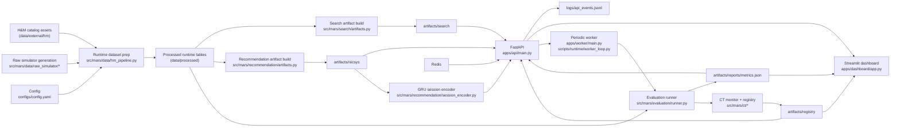

# System Architecture

## Overview

The final architecture is an H&M-backed MARS runtime composed of four operational layers:

1. **Data preparation** from H&M-backed catalog inputs and simulator-derived user behavior
2. **Artifact generation** for multimodal search and recommendation
3. **Serving and interaction capture** through FastAPI, Redis, and durable logs
4. **Evaluation and operator visibility** through the worker, registry, and Streamlit dashboard

The active runtime is centered on `apps/`, `src/mars/`, and `scripts/`. `apps/` contains the service entrypoints used by Docker Compose, `src/mars/` contains the core feature packages, and `scripts/` contains build/evaluation/runtime utilities used behind those entrypoints. Raw simulator generation lives under `src/mars/data/raw_simulator`, while `src/` is now kept only as a tiny evaluation compatibility path.

## Component Diagram

## Runtime Flow

### 1. Bootstrap

`scripts/runtime/bootstrap_runtime.py` is the submission bootstrap path. It:

- loads config and creates runtime directories
- prepares processed runtime tables with `prepare_runtime_dataset`
- builds search artifacts
- builds recommendation artifacts
- runs evaluation
- evaluates continuous-training thresholds
- optionally registers the resulting artifact version

### 2. Serving

`apps/api/main.py` creates a FastAPI app and binds:

- `/healthz` for system readiness
- `/api/search` for multimodal retrieval
- `/api/recommend` for multi-stage recommendation
- `/api/events` for event ingestion and durable logging
- `/api/metrics` for dashboard metrics
- `/api/ab/assign` and `/api/ab/report` for A/B support

The API delegates orchestration to `apps/api/service_adapters.py`, which loads the final MARS services and provides fallback behavior when artifacts or Redis are unavailable.

Recommendation serving uses `src/mars/recommendation/session_encoder.py` to turn Redis `recent_products` into a short-term session embedding with a PyTorch GRU. The recommendation service combines that GRU session vector with the long-term User Tower vector before FAISS candidate generation.

### 3. Monitoring

`apps/worker/main.py` is the Docker-facing worker entrypoint and delegates to `scripts/runtime/worker_loop.py`. The worker periodically reruns `mars.evaluation.runner.run_evaluation()` and feeds the result into `mars.ct.monitor.CTMonitor`. This produces:

- an updated metrics report
- a continuous-training decision state
- thresholds for CTR, hit rate, and new log accumulation

### 4. Dashboard

The dashboard reads from the API first and falls back to demo payloads if the API is unavailable. This keeps the operator UI usable during backend work and makes demos resilient.

## Data Surfaces

| Layer | Location | Purpose |
|---|---|---|
| External inputs | `data/external/hm/` | H&M-backed raw and processed catalog assets |
| Raw simulator outputs | `data/raw/` | Intermediate product, user, and event CSVs |
| Processed runtime tables | `data/processed/` | Normalized product, user, event, session, and split tables |
| Search artifacts | `artifacts/search/` | Metadata parquet, embeddings, and vector indexes |
| Recommendation artifacts | `artifacts/recsys/` | Serialized recommendation artifact bundle |
| Reports | `artifacts/reports/` | Evaluation summaries and metric outputs |
| Registry/CT state | `artifacts/registry/` | Active model version and retrain-watch state |
| Logs | `logs/` | Durable API event log |

## Architectural Decisions

### Final runtime kept compact

- `apps/`, `src/mars/`, and `scripts/` are the final submission runtime.
- `apps/api`, `apps/dashboard`, `apps/simulator`, and `apps/worker` now make the four Docker-facing app surfaces explicit.
- Raw simulator fallback code lives under `src/mars/data/raw_simulator/` so data-generation logic stays near the H&M runtime pipeline.
- `src/` is intentionally reduced to the evaluation compatibility wrapper requested by the specification wording.

### Artifact-first search and recommendation

- Search and recommendation do not retrain on every request.
- Bootstrap prepares artifacts once, then services load them for online inference.
- This matches the capstone need for reproducible demos and clear submission artifacts.

### Graceful degradation

- If Redis is unavailable, the API still serves fallback recommendation context.
- If built artifacts are unavailable, fallback data still keeps endpoint contracts alive.
- The dashboard similarly falls back to demo payloads.

### Evaluation tied to monitoring

- Evaluation results are not isolated reports; they feed the worker and continuous-training state.
- This gives the system a full loop from artifact build to quality reporting to retrain decisions.

## Deployment Topology

The default deployment is the Compose stack in `docker-compose.yml`:

- `bootstrap`
- `api`
- `dashboard`
- `worker`
- `redis`

All Python services share the same application image from `Dockerfile`, which keeps environment drift low across demo roles.

